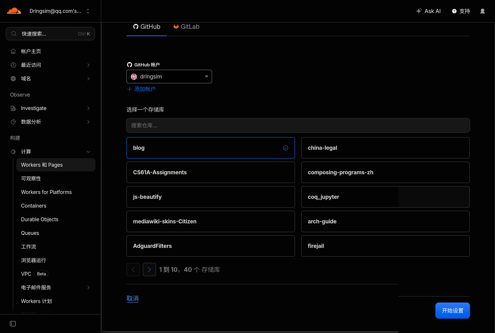
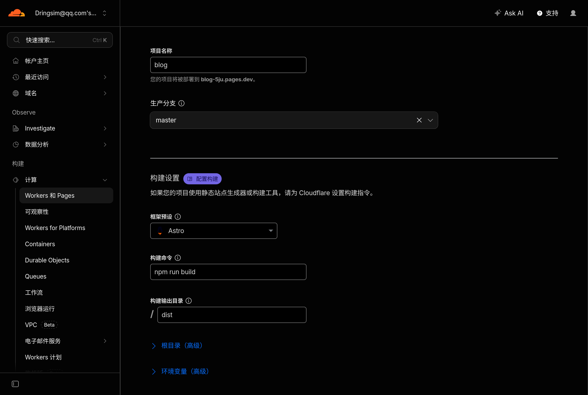
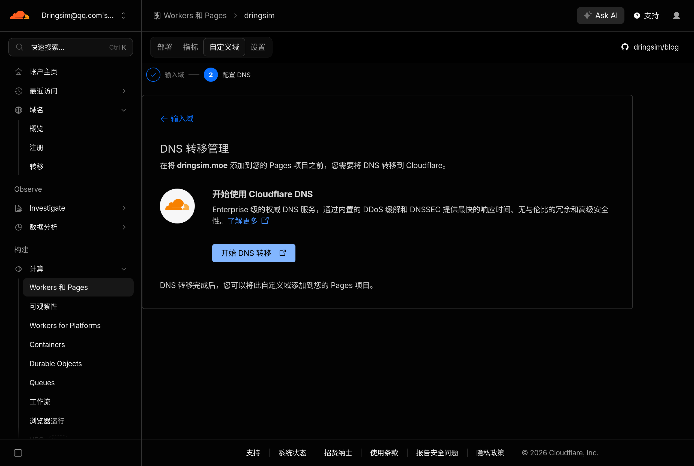
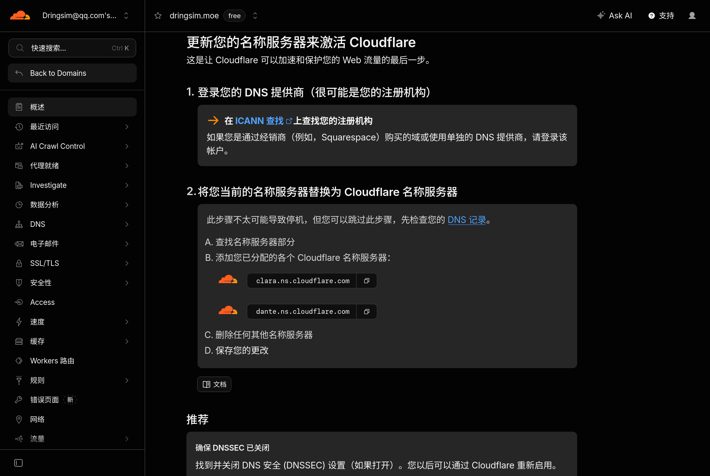
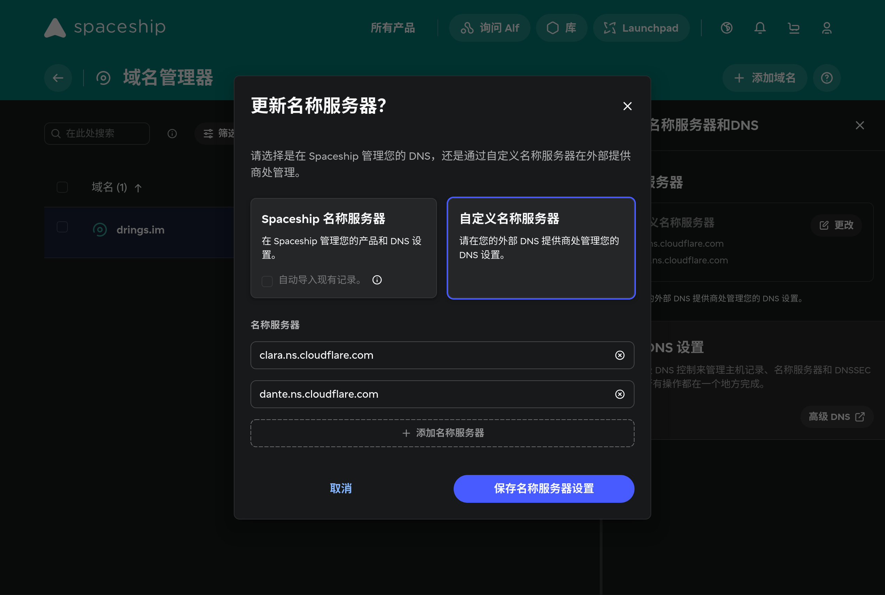
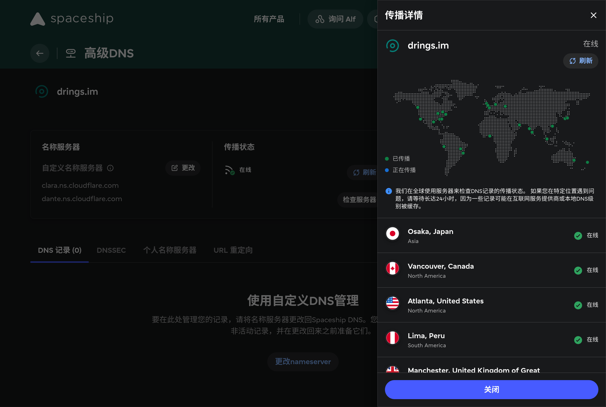
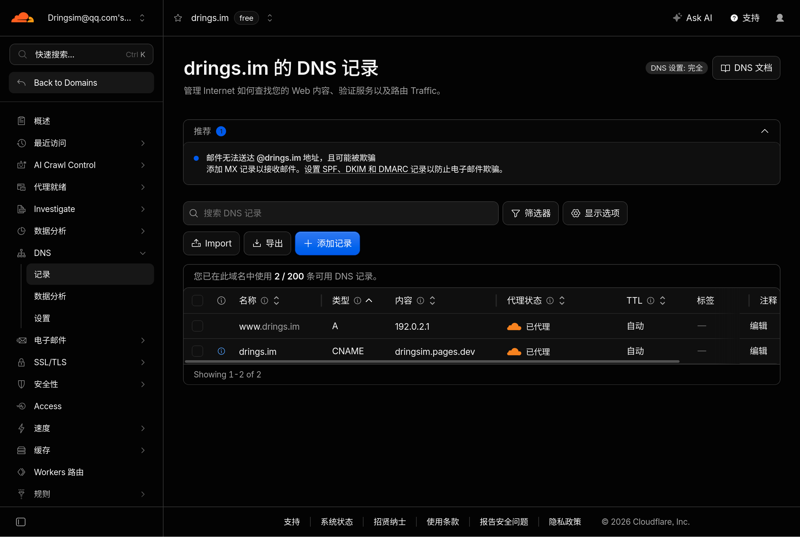
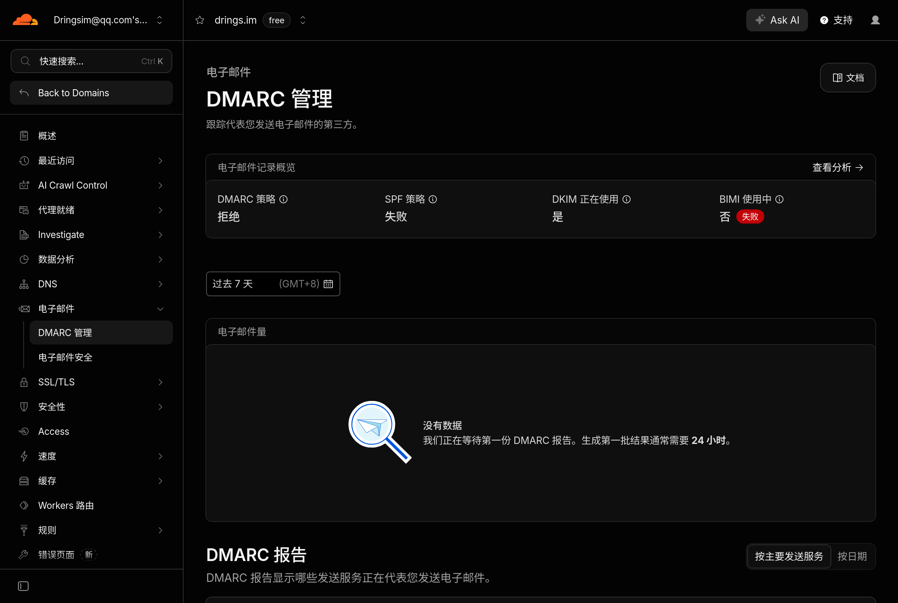
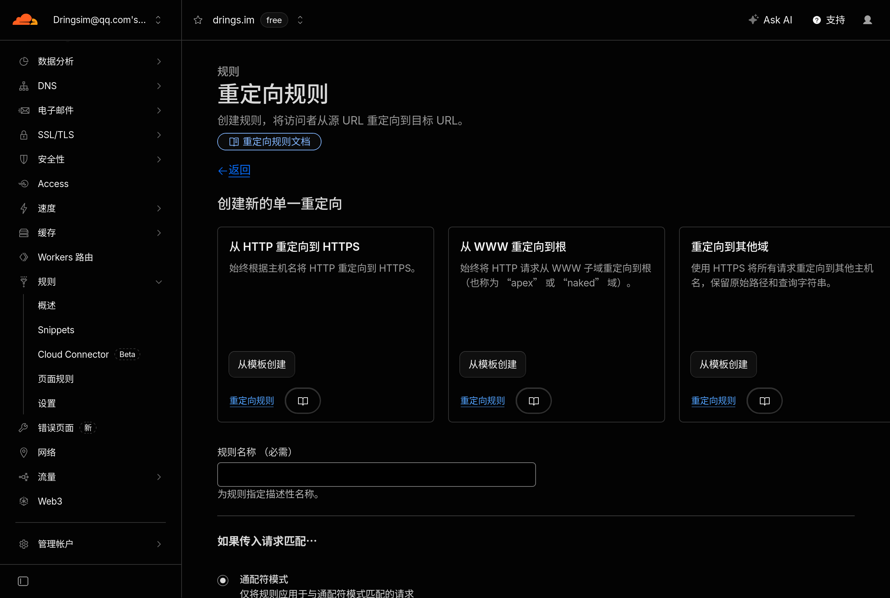

## 安装博客主题

按[Firefly文档](https://docs-firefly.cuteleaf.cn/zh/guide/getting-started.html)的说明操作：

```bash
# 克隆仓库
git clone https://github.com/CuteLeaf/Firefly.git blog
cd blog
# 安装依赖
pnpm install
# 构建
pnpm build
# 预览
pnpm preview

# 设置远程仓库
git remote set-url origin https://github.com/dringsim/blog
# 推送
git push -u origin main
```

如果需要拉取上游更新：

```bash
# 添加上游仓库
git remote add upstream https://github.com/CuteLeaf/Firefly.git
# 拉取更新
git fetch upstream
# 合并
git merge upstream/master
# 如果出现合并冲突，手动解决冲突后commit
git add .
git commit -m "merge: update Firefly theme"
```

## 部署在Cloudflare Pages

打开[Cloudflare Dashboard](https://dash.cloudflare.com/)，在左侧“计算”中选择“Workers和Pages”，点击“创建应用程序”，再点击“想要部署Pages？”之后的“开始使用”，选择“导入现有Git存储库”，然后账号授权并选择仓库。



填写项目名称，构建命令填写`pnpm build{:bash}`，构建输出目录填写`dist`，点击“保存并部署”。



后续向仓库生产分支的推送都会自动部署。

## 自定义域名

### 绑定域名

可以在[Spaceship](https://www.spaceship.com/)购买到较为廉价的域名。

在“Workers和Pages”中选择之前创建的Pages项目，点击“自定义域”。如果输入的自定义域名不是在Cloudflare购买的，Cloudflare会提示“需要将DNS转移到Cloudflare”，此时需要到域名服务商处（例如Spaceship的[域名管理器](https://www.spaceship.com/zh/application/domain-list-application/)）将域名的名称服务器修改为Cloudflare的名称服务器。







待新的名称服务器传播到全球后，就可以在Cloudflare管理DNS记录了。



之后回到Pages项目设置自定义域名。Cloudflare会添加下述DNS记录：

| 名称 | 类型 | 内容 | 代理状态 | TTL |
| ---- | ---- | ---- | -------- | --- |
| `@` | CNAME | `<YOUR_SITE>.pages.dev`（项目默认域名） | 已代理 | 自动 |

可以用`nslookup{:bash}`命令检查DNS是否生效。

绑定域名后，还需将`src/config/siteConfig.ts`的`siteConfig.site_url{:js}`字段修改为实际的域名。

### 防止电子邮件欺骗

建议添加限制性DNS记录以防止电子邮件欺骗。在Cloudflare Dashboard左侧“域名”下的“概览”选择自己的域名，在左侧“DNS”下的“记录”中管理DNS记录。按照“推荐”拦的提示添加限制性记录。




| 名称 | 类型 | 内容 | TTL |
| ---- | ---- | ---- | --- |
| `@` | TXT | `"v=spf1 -all"` | 自动 |
| `*._domainkey` | TXT | `"v=DKIM1; p="` | 自动 |
| `_dmarc` | TXT | `"v=DMARC1; p=reject; sp=reject; adkim=s; aspf=s;"` | 自动 |

这些记录会通知接收邮件服务器丢弃从该域名发送的所有传入电子邮件。



### 配置重定向

Cloudflare提供了规则模板，可以创建从HTTP重定向到HTTPS以及从WWW子域重定向到根域名的重定向规则。在Cloudflare域名管理页面左侧“规则”下的“概述”添加重定向规则。



要使WWW重定向到根的规则生效，还需添加一条DNS记录：

| 名称 | 类型 | 内容 | 代理状态 | TTL |
| ---- | ---- | ---- | -------- | --- |
| `www` | A | `192.0.2.1`（放弃请求） | 已代理 | 自动 |

## 魔改

### 自定义样式

在`src/layouts/MainGridLayout.astro`加入一行`import "@/styles/custom/custom.css";{:js}`，接下来就可以加料了，例如`text-autospace: normal{:css}`：

```css title="src/styles/custom/custom.css"
/* https://zh.wikipedia.org/wiki/MediaWiki:Gadget-text-spacing.css */
:root {
	text-autospace: normal;
}

/* Firefox & Safari bug: https://github.com/w3c/csswg-drafts/issues/9979 */
:lang(ko),
/* Monospace (and likely monospace) elements */
code, kbd, pre, rp, rt, samp, textarea, var,
/* Elements with this class are excluded */
.nospace,
/* Editable elements */
[contenteditable="true"] {
	text-autospace: no-autospace;
}
```

还有IPA（[/ˌaɪ.piːˈeɪ/]{.IPA}）的字体样式：

```css title="src/styles/custom/custom.css"
/* https://en.wiktionary.org/wiki/MediaWiki:Gadget-LanguagesAndScripts.css */
.IPA {
	font-family: Gentium, 'Gentium Plus', GentiumAlt, 'DejaVu Sans', 'Segoe UI', 'Lucida Grande', 'Charis SIL', 'Doulos SIL', 'TITUS Cyberbit Basic', 'Code2000', 'Lucida Sans Unicode', sans-serif;
	font-size: 110%;
	font-variant-ligatures: no-common-ligatures;
}
```

导入其它样式表：

```css title="src/styles/custom/custom.css"
@import './rehype-pretty.css';
```

### 行内代码高亮

Firefly使用[Expressive Code](https://expressive-code.com/)提供代码高亮，而Expressive Code[尚不支持这一功能](https://github.com/expressive-code/expressive-code/discussions/395)。[Rehype Pretty Code](https://rehype-pretty.pages.dev/)提供了这一功能。[可以将这两者联用](https://github.com/expressive-code/expressive-code/discussions/395)，但要注意Expressive Code必须先于Rehype Pretty Code加载。此时，已通过Astro集成加载Expressive Code时，就不能把`rehypePrettyCode{:.entity.name.function}`直接塞进`rehypePlugins{:.variable.object.property}`了，要用Astro集成包装一下，再放到`expressiveCode(){:js}`之后。这里拿[astro-expressive-code](https://github.com/expressive-code/expressive-code/tree/main/packages/astro-expressive-code/src)的代码改一下，并同时加入对应的样式：

::: code-group labels=[src/plugins/custom/astro-rehype-pretty.ts, src/styles/custom/rehype-pretty.css]

```ts
import type { AstroIntegration } from "astro";
import rehypePrettyCode from "rehype-pretty-code";
import type { BuiltinTheme } from "shiki";
import { expressiveCodeConfig } from "../../config/";

type ConfigSetupHookArgs = Parameters<
	NonNullable<AstroIntegration["hooks"]["astro:config:setup"]>
>[0];

export default function astroRehypePretty() {
	return {
		name: "astro-rehype-pretty",
		hooks: {
			"astro:config:setup": async (args: unknown) => {
				const { config: astroConfig } = args as ConfigSetupHookArgs;

				const markdownProcessorOptions = astroConfig.markdown.processor
					.options as { rehypePlugins: unknown[] };
				markdownProcessorOptions.rehypePlugins.push(() =>
					rehypePrettyCode({
						theme: {
							light: expressiveCodeConfig.lightTheme as BuiltinTheme,
							dark: expressiveCodeConfig.darkTheme as BuiltinTheme,
						},
					}),
				);
			},
		},
	} satisfies AstroIntegration;
}
```

```css
code[data-theme*=" "],
code[data-theme*=" "] span {
    color: var(--shiki-light);
}

:root.dark {
    code[data-theme*=" "],
    code[data-theme*=" "] span {
        color: var(--shiki-dark);
    }
}
```

:::

### 着重号

Linca[写了个rehype插件](https://lhcfl.github.io/blog/2026-06-22-%E4%BB%8E%E5%8D%9A%E5%AE%A2%E7%BE%8E%E5%8C%96%E5%BC%80%E5%A7%8B%E7%9A%84%E6%8E%92%E7%89%88%E5%AD%A6%E7%AC%94%E8%AE%B0/)来处理中西文混排的强调样式。这个插件会给含有汉字的`<em>{:html}`都加上`lang="zh"{:html}`。但是呢，有汉字的文本*不一定是中文*……

[《中文排版需求》](https://www.w3.org/TR/clreq/#id84)规定“当中文与日文文本相互嵌入时，着重号的使用需遵循文本的主要语言风格”。这里我们对插件稍作修改，对含有汉字、注音符号、假名或谚文的文本都使用在文本下方的圆形中黑点作为着重号：

::: code-group labels=[src/plugins/custom/rehype-em-cjk.ts, src/styles/custom/custom.css]

```ts
import type { Root } from "hast";
import { toString as hastToString } from "hast-util-to-string";
import { visit } from "unist-util-visit";

export default function rehypeEmCJK() {
	return (tree: Root) => {
		visit(tree, "element", (node) => {
			if (["em"].includes(node.tagName)) {
				const textContent = hastToString(node);

				if (
					textContent.match(
						/[\p{Script=Hani}\p{Script=Hira}\p{Script=Kana}\p{Script=Hang}\p{Script=Bopo}]+/gu,
					)
				) {
					node.properties.className = node.properties.className ?? [];
					node.properties.className.push("em-cjk");
				}
			}
		});
	};
}
```

```css
em.em-cjk {
	border-bottom: inherit;
	padding-bottom: 0;
	font-style: normal;
    text-emphasis: filled dot;
    text-emphasis-position: under right;
}
```

:::

### CSS class和注音标记

用从[koharu主题](https://github.com/cosZone/astro-koharu)搬来的[rehype-shoka-attrs.ts](https://github.com/cosZone/astro-koharu/blob/main/src/lib/markdown/rehype-shoka-attrs.ts)和[remark-shoka-ruby.ts](https://github.com/cosZone/astro-koharu/blob/main/src/lib/markdown/remark-shoka-ruby.ts)实现CSS class和{注^zhù}{音^yīn}标记。
