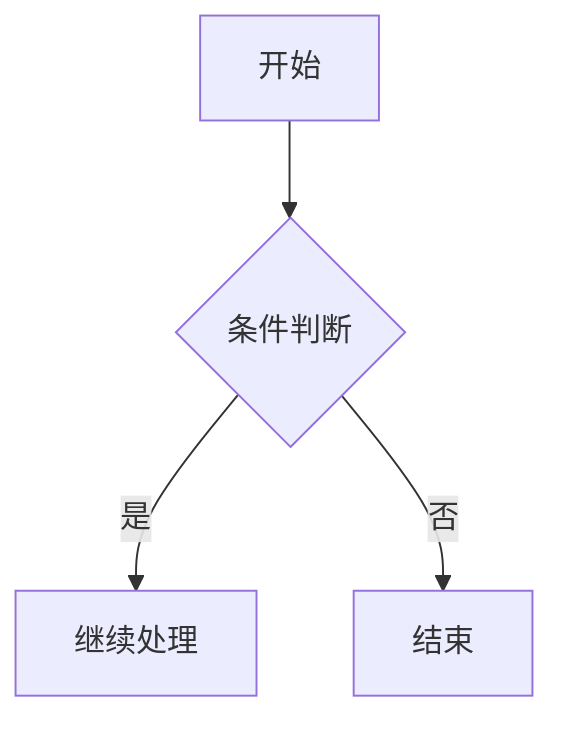
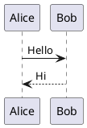

The result of `[1, 2, 3].join('-'){:js}` is `'1-2-3'{:js}`.

Lift($$L$$) can be determined by Lift Coefficient ($$C_L$$) like the following
equation.

$$
L = \frac{1}{2} \rho v^2 S C_L
$$

```elixir title="fib.ex" showLineNumbers {6-7, 9} /palindrome/
defmodule Solution do
  @spec is_palindrome(x :: integer) :: boolean
  def is_palindrome(x) when x < 0, do: false
  def is_palindrome(x), do: do_is_palindrome(x, get_base_10(x, 1))

  defp do_is_palindrome(x, b10) when b10 > 1,
    do: get_first_digit(x, b10) == rem(x, 10) and do_is_palindrome(div(x, 10), div(b10, 100))

  defp do_is_palindrome(_, _), do: true

  defp get_first_digit(n, b10), do: div(n, b10) |> rem(10)

  defp get_base_10(n, b10) when n >= b10, do: get_base_10(n, b10 * 10)
  defp get_base_10(n, b10), do: div(b10, 10)
end
```

```lilypond
  \transpose c bes {
    \relative c {
      \key c \major
      e4 a g2 d'4 a g2
      d'4. (e8) d4. e8 b4 a g2
      e4 c' a2 e'4 c a2
      d4 g2 e8. (d16) c1 \break

      e,4 a g2 d'4 a g2
      d'4. e8 d4. e8 b4 a g2
      e4 c' a2 e'4 c a2
      d4 g2 e8. (d16) c1 \break

      g'4. e8 d4 c b8 (a) g (a) c2
      e,4 d' b a8 (g) e4 g8 a b4. (a8) g1~ g \break
      g'4. e8 d4 c b8 (a) g (a) c4 c
      e,4 d' b a8 (g) e4 g8 a b4. c8 d8. (e16 d8 c) b8. (a16 b8) c d4 g,4 r2 \break

      e4 a g2 d'4 a g2
      d'4. e8 d4. e8 b4 a g2
      e4 c' a2 e'4 c a2
      d4 g2 e8. (d16) c1 \break
    }
    \addlyrics {
      夜 上 海 夜 上 海
      你 是 個 不 夜 城
      華 燈 起 樂 聲 響
      歌 舞 昇 平

      只 見 她 笑 臉 迎
      誰 知 她 內 心 苦 悶
      夜 生 活 都 為 了
      衣 食 住 行

      酒 不 醉 人 人 自 醉
      胡 天 胡 帝 蹉 跎 了 青 春
      曉 色 朦 朧 倦 眼 惺 忪
      大 家 歸 去 心 靈 兒 隨 着 轉 動 的 車 輪

      換 一 換 新 天 地
      別 有 一 個 新 環 境
      回 味 着 夜 生 活
      如 夢 初 醒
    }
  }
```





简单 7 课，帮助你快速学会 Teambition 的基本操作。

我们需要一位熟悉 JavaScript、HTML5，至少理解一种框架（如 Backbone.js、AngularJS、React 等）的前端开发者。

<span class="IPA">/pʰáz.ɡa.non/</span>

喵喵
